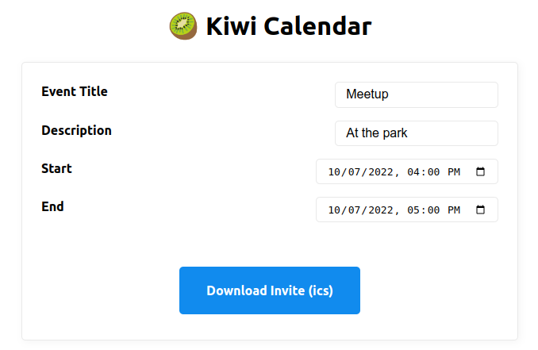

# 🥝 Kiwi Calendar

View it live at [https://kiwical.deno.dev/](https://kiwical.deno.dev/)

Serverless[^1] calendar written in Typescript for Deno Deploy, inspired by the [zerocal project](https://endler.dev/2022/zerocal/).

## The name
Why the name kiwi? My thinking went like this: *"Calendar... I use the Thunderbird calendar... Thunderbird is a flightless bird. Zero is like 'flightless'. Kiwis are also flightless."*

## Project structure

The integral files are:

- kiwi.ts - handles the request routing and building the ics data
- view.html - create the UI served at /cal. Raw HTML is refreshing[^2]
- view.js - minimal UX improvements, updating the curl as form fields change

## Built with

- [Deno Deploy](https://deno.com/deploy)
- [Sift router](https://github.com/satyarohith/sift) for Deno
- [Simple ICS](https://github.com/PeronGH/simple-ics)
- [MVP.css](https://andybrewer.github.io/mvp/)
- [Use Emoji as favicon](https://css-tricks.com/emoji-as-a-favicon/)

[^1]: This was controversial in the [HackerNews comments](https://news.ycombinator.com/item?id=33109513)
[^2]: I think there  is some kind of raw HTML movement that I remember reading about on HackerNews. If you know what I mean and share a link as a Github issue, I'd appreciate that a lot.
